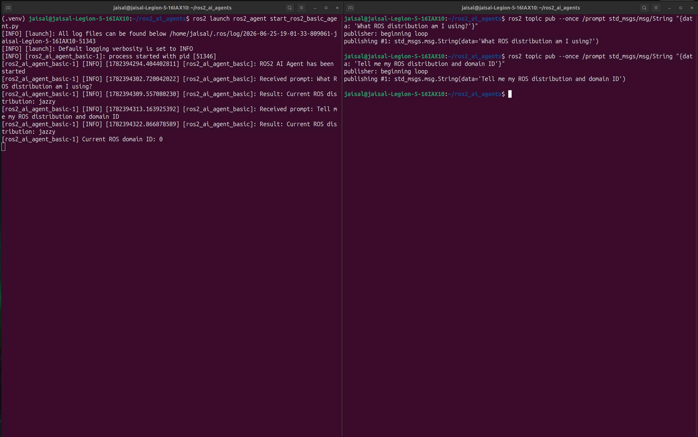
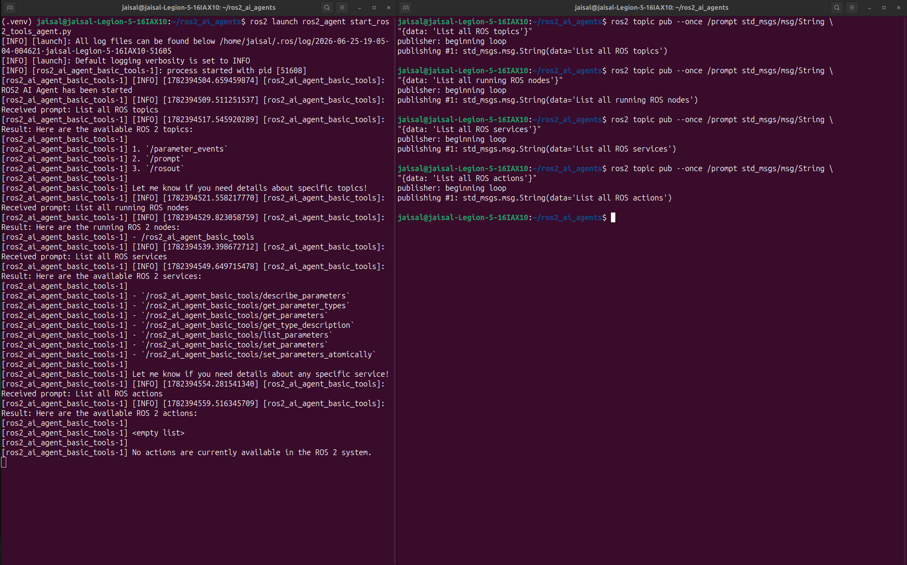
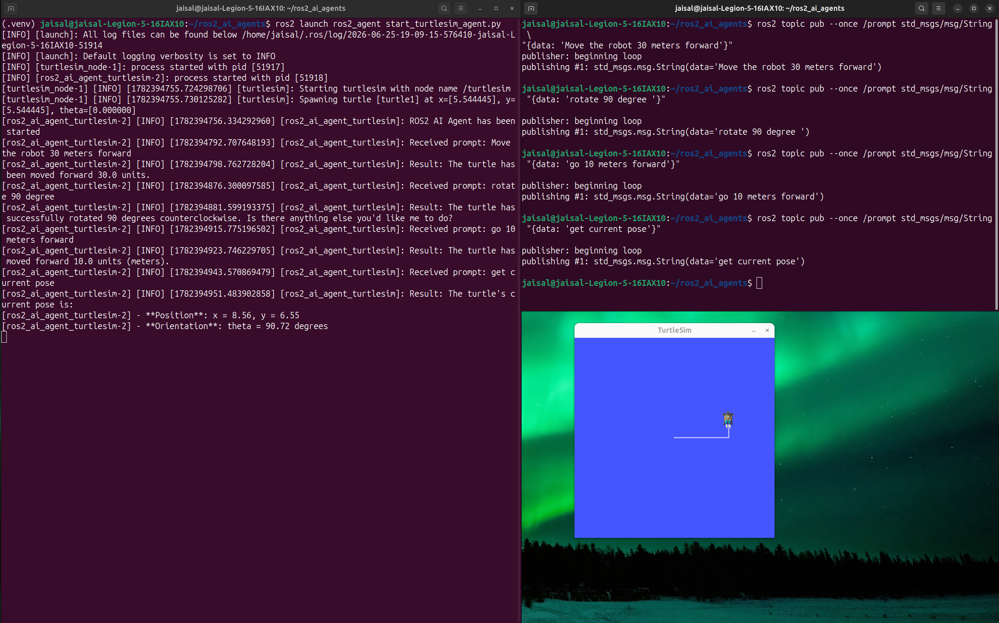
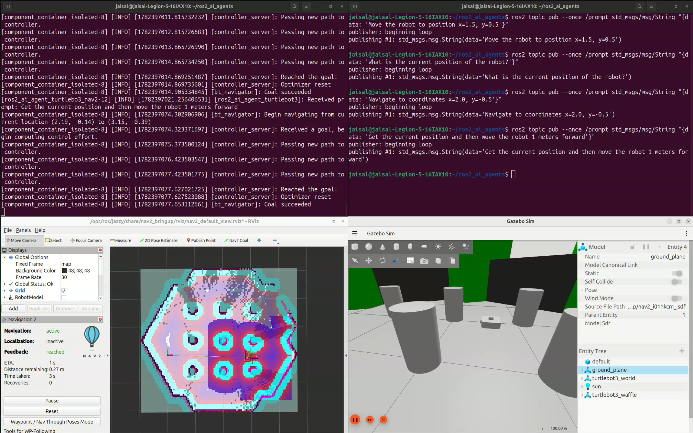
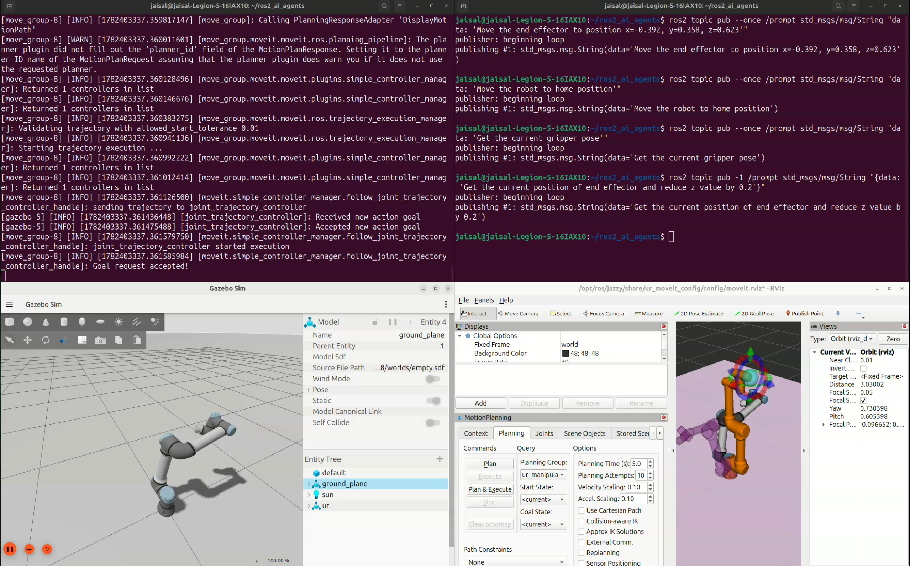

# ROS 2 AI Agents

> **Natural language control for ROS 2 robots using local Large Language Models (LLMs), LangChain, Ollama, Nav2, and MoveIt 2.**

This project provides a collection of AI-powered ROS 2 agents capable of understanding natural language instructions and interacting with different parts of the ROS 2 ecosystem. By combining **ROS 2 Jazzy**, **Ollama**, **LangChain**, **Nav2**, and **MoveIt 2**, the agents can inspect the ROS graph, control simulated robots, perform autonomous navigation, and execute robotic manipulation tasks entirely through natural language prompts.

Unlike cloud-based implementations, this project runs completely **locally** using Ollama, making it suitable for offline development, experimentation, and robotics applications.

The project is designed as a modular framework where each agent exposes a different set of ROS 2 tools, allowing a local LLM to interact with robots through natural language.

---

---

# Features

- Natural language robot interaction
- Local LLM inference using Ollama
- LangChain tool-calling agents
- ROS 2 topic, service, and action introspection
- Turtlesim motion control
- TurtleBot3 autonomous navigation using Nav2
- Universal Robots (UR10e) manipulation using MoveIt 2
- Gazebo Sim integration
- RViz visualization
- Extensible tool-based agent architecture
- Local-first deployment without external APIs

---

# Repository Structure

| Package      | Description                                  |
| ------------ | -------------------------------------------- |
| `ros2_agent` | AI agent implementations for ROS 2           |
| `launch`     | Launch files for all AI agent demonstrations |
| `docs`       | Images and demonstration videos              |
| `resource`   | ROS 2 package resources                      |
| `test`       | Package tests                                |

---

# Supported AI Agents

| Agent               | Description                                      |
| ------------------- | ------------------------------------------------ |
| **Basic Agent**     | General-purpose ROS 2 conversational agent       |
| **ROS Tools Agent** | Queries ROS topics, nodes, services, and actions |
| **Turtlesim Agent** | Controls turtlesim using natural language        |
| **Nav2 Agent**      | Commands TurtleBot3 navigation using Nav2        |
| **MoveIt 2 Agent**  | Controls a UR10e manipulator using MoveIt 2      |

---

# Technologies Used

- ROS 2 Jazzy
- Python
- LangChain
- Ollama
- Qwen 3:8b
- Gazebo Sim
- RViz2
- Nav2
- MoveIt 2
- rclpy
- TurtleBot3
- Universal Robots
- ros2_control

---

# Prerequisites

Install ROS 2 Jazzy and the required robotics packages.

```bash
sudo apt install \
ros-jazzy-gazebo-ros-pkgs \
ros-jazzy-nav2-bringup \
ros-jazzy-navigation2 \
ros-jazzy-turtlebot3* \
ros-jazzy-moveit \
ros-jazzy-ur \
ros-jazzy-ur-simulation-gz \
ros-jazzy-ros-gz
```

Install Ollama.

```bash
curl -fsSL https://ollama.com/install.sh | sh
```

Download a local model.

```bash
ollama pull qwen3:8b
```

---

# Python Environment

Create a virtual environment.

```bash
python3 -m venv .venv

source .venv/bin/activate

pip install -r requirements.txt
```

---

# Build

```bash
source /opt/ros/jazzy/setup.bash

colcon build

source setup_env.sh
```

---

# Environment Setup

The repository includes a helper script for setting up the environment.

```bash
source setup_env.sh
```

This script automatically:

- Activates the Python virtual environment
- Sources ROS 2 Jazzy
- Configures the Python path
- Sources the workspace

---

# 1. Basic ROS 2 AI Agent

Launch the basic conversational ROS 2 agent.

```bash
ros2 launch ros2_agent start_ros2_basic_agent.py
```

Example prompts:

```bash
ros2 topic pub --once /prompt std_msgs/msg/String "{data: 'What ROS
distribution am I using?'}"

ros2 topic pub --once /prompt std_msgs/msg/String "{data: 'What is my ROS
domain ID?'}"
```

### Features

- Local LLM integration
- Natural language interaction
- ROS 2 node architecture
- Local inference using Ollama

### Result



---

# 2. ROS 2 Tools Agent

Launch the tools-enabled AI agent.

```bash
ros2 launch ros2_agent start_ros2_tools_agent.py
```

Example prompts:

```bash
ros2 topic pub --once /prompt std_msgs/msg/String \
"{data: 'List all ROS topics'}"

ros2 topic pub --once /prompt std_msgs/msg/String \
"{data: 'List all running ROS nodes'}"
```

### Features

- ROS graph inspection
- Topic discovery
- Node discovery
- Service discovery
- Action discovery

### Result



---

# 3. AI Agent for Turtlesim

Launch the Turtlesim AI agent.

```bash
ros2 launch ros2_agent start_turtlesim_agent.py
```

Example prompts:

```bash
ros2 topic pub --once /prompt std_msgs/msg/String \
"{data: 'Move the turtle forward'}"

ros2 topic pub --once /prompt std_msgs/msg/String \
"{data: 'Rotate 90 degrees'}"
```

### Features

- Turtle motion control
- Rotation control
- Pose retrieval
- Natural language command execution

### Result



---

# 4. AI Agent for Nav2

Launch the TurtleBot3 navigation stack together with the AI agent.

```bash
ros2 launch ros2_agent start_turtlebot3_nav2_agent.py
```

Example prompts:

```bash
ros2 topic pub --once /prompt std_msgs/msg/String \
"{data: 'Move the robot to position x=1.5, y=0.5'}"

ros2 topic pub --once /prompt std_msgs/msg/String \
"{data: 'What is the current position of the robot?'}"

ros2 topic pub --once /prompt std_msgs/msg/String \
"{data: 'Get the current position and then move the robot 1 meter forward'}"
```

### Features

- Autonomous navigation
- Goal-based path planning
- Current pose retrieval
- Nav2 Simple Commander integration
- Gazebo simulation
- RViz visualization

### Result



🎥 `docs/videos/nav2-agent.mp4`

---

# 5. AI Agent for MoveIt 2

Launch the UR10e MoveIt 2 simulation together with the AI agent.

```bash
ros2 launch ros2_agent start_ur_moveit2_agent.py
```

Example prompts:

```bash
ros2 topic pub --once /prompt std_msgs/msg/String \
"{data: 'Move the end effector to position x=-0.392, y=0.358, z=0.623'}"

ros2 topic pub --once /prompt std_msgs/msg/String \
"{data: 'Move the robot to home position'}"

ros2 topic pub --once /prompt std_msgs/msg/String \
"{data: 'Get the current pose and reduce z by 0.2 meters'}"
```

### Features

- Motion planning
- Cartesian pose planning
- End-effector pose retrieval
- Named target execution
- MoveIt 2 integration
- Gazebo execution
- RViz visualization

### Result



---

# Project Layout

```text
.
├── src
│   ├── ros2_agent
│   ├── launch
│   ├── resource
│   ├── test
│   ├── setup.py
│   ├── package.xml
│   └── requirements.txt
├── docs
│   ├── images
│   └── videos
├── setup_env.sh
├── README.md
└── .gitignore
```

---

# System Architecture

```text
                  Natural Language Prompt
                            │
                            ▼
                     Ollama (Qwen 3:8b)
                            │
                            ▼
                   LangChain AI Agent
                            │
                            ▼
                  Custom ROS 2 Tool Calls
                            │
        ┌───────────────────┼───────────────────┐
        │                   │                   │
        ▼                   ▼                   ▼
   ROS Graph          Navigation          Manipulation
(Topics/Nodes)          (Nav2)            (MoveIt 2)
        │                   │                   │
        └───────────────────┼───────────────────┘
                            ▼
                     ROS 2 Middleware
                            │
                            ▼
                 Gazebo Sim + RViz2
                            │
                            ▼
                    Robot State Feedback
```

---

# Future Improvements

- Multi-agent orchestration
- Vision-language robot agents
- Voice-based interaction
- Multi-robot coordination
- Semantic task planning
- Integration with physical robots
- Web-based dashboard for interacting with AI agents

---
